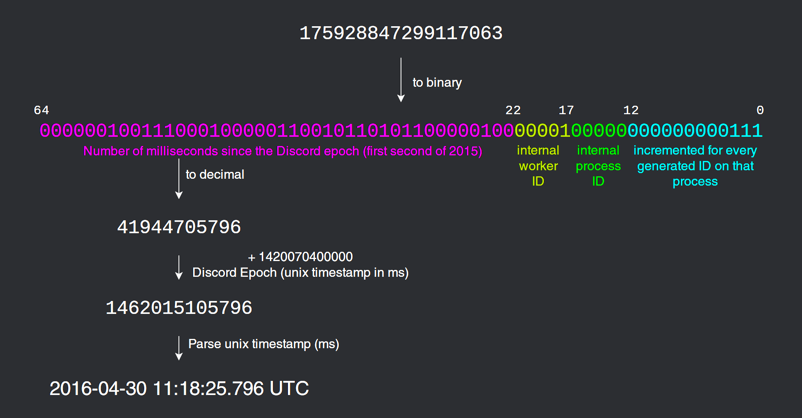

# snowflakey
> A lightweight Node.js snowflake generator/lookup tool

> [GitHub](https://www.github.com/PassTheWessel/Snowflakey) **|** [NPM](https://www.npmjs.com/package/snowflakey)

## Installing
```sh
$ yarn add snowflakey # Install w/ Yarn (the superior package manager)
$ npm i snowflakey # Install w/ NPM
```

## Usage
##### Code
```js
// require & generate the instance
const Snowflake = require( './generator' );
const snowflake = new Snowflake.generator({
  processBits: 0,
  workerBits: 8,
  incrementBits: 14,
  workerId: process.env.CLUSTER_ID || 31
});

// exports for global use
exports.makeSnowflake   = ( date ) => { return snowflake._generate( date ); };
exports.unmakeSnowflake = ( flake ) => { let decon = snowflake.deconstruct( flake ); return decon.timestamp.valueOf(); };

// example
const flake = this.makeSnowflake( Date.now() );
console.log( flake );
console.log( `Creation date: ${Snowflake.lookup( flake, 1420070400000 )}` );
console.log( this.unmakeSnowflake( flake ) );
```
##### Result
```sh
$ node test.js
534760094454759424
Creation date: 2019-1-15 16:45:41
1547567141880
```

### What is a snowflake?
Snowflakes are strings that range from 14 to 19 characters long that can give every user it's unique idea. You can't get much data with just a snowflake, but you can get the creation date of the snowflake and identify every unique user with it.
